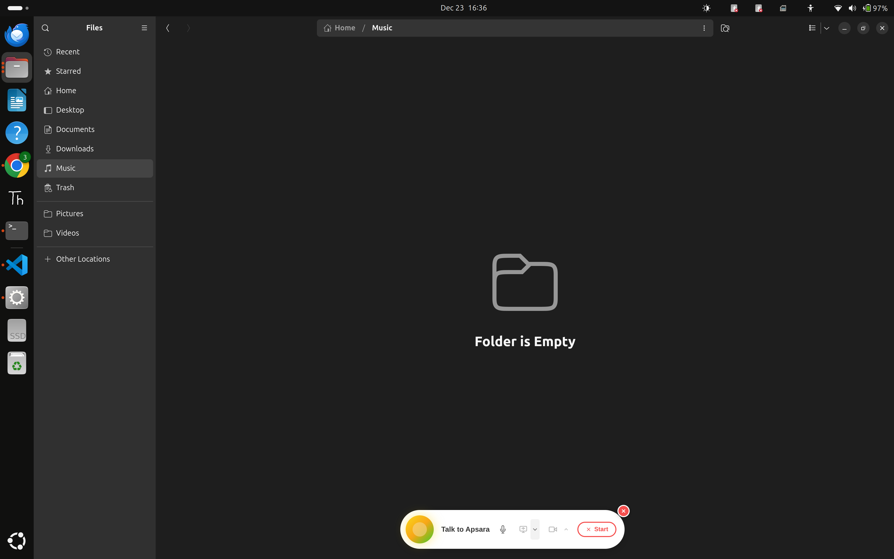

# Apsara AI - Voice Assistant System 🎙️✨


**Version 1.2.0** - Enhanced UI/UX & Visual Consistency

A complete voice assistant system powered by Google's Gemini 2.5 Flash Experimental AI, featuring a beautiful React widget, Electron desktop app with camera and screen sharing, and Node.js backend with WebSocket communication.



## 🌟 Features

### Voice Interaction
- **Real-time Voice Chat**: Talk naturally to Apsara AI with ultra-low latency streaming
- **Interrupt Capability**: Interrupt Apsara at any time to ask follow-up questions
- **Smart Muting**: Mute your microphone while still seeing Apsara's responses
- **Dynamic Visualizer**: Beautiful audio visualization that changes based on who's speaking
  - 🟢 **Green/Gold bars** when you speak
  - 🟠 **Dramatic orange spikes** when Apsara speaks
- **Clean Visual Indicators**: Minimalist green pulsing dots show active camera/screen share status

### Visual Capabilities
- **Camera Sharing**: Share your camera feed with Apsara for visual interaction (green dot indicator when active)
- **Screen Sharing**: Share your entire screen for visual assistance (green dot indicator when active)
- **Real-time Video Processing**: Apsara can see and analyze what you show via camera or screen
- **High-Quality Streaming**: Optimized video compression and frame rate for smooth experience

### What Apsara Can Do
Apsara is powered by Google's Gemini 2.0 Flash Experimental model with real-time voice capabilities:

- **Answer Questions**: Get instant answers about any topic
- **Have Conversations**: Natural, flowing conversations with context awareness
- **Real-time Google Search**: Automatic access to current events, news, weather, sports, latest tech updates
- **Send Email**: Can send messages to Shubharthak via email
- **Help with Tasks**: Assistance with planning, problem-solving, and decision-making
- **Creative Support**: Help with writing, brainstorming, and creative projects
- **Real-time Interaction**: Ultra-low latency responses (typically 200-400ms)

### Platform Support
- ✅ **Web Browser**: Works in any modern browser (Chrome, Firefox, Safari, Edge)
- ✅ **Linux Desktop**: Native desktop widget with Electron (fully tested and production-ready!)
- ✅ **Windows Desktop**: Electron supports Windows - same codebase works (requires testing)
- ✅ **macOS Desktop**: Electron supports macOS - same codebase works (requires testing)

**Note on Cross-Platform:** The Electron app is built with cross-platform compatibility in mind. While fully tested on Linux, the same codebase should work on Windows and macOS with minimal to no changes. Electron abstracts OS-specific details, and our tools (screenshot, clipboard) include platform-specific implementations for Windows, macOS, and Linux.

### Desktop Widget Features (Electron)
- **Frameless Window**: Transparent, borderless window showing only the widget
- **Always-on-Top**: Stays visible above all other windows
- **Draggable Widget**: Click and drag the widget panel to move it anywhere
- **Clickable Controls**: All buttons remain fully functional while dragging
- **Close Button**: Red X button at top-right corner to exit the app
- **Camera Sharing**: Full camera integration with visual feedback
  - 🟢 **Green Indicator Dot**: Pulsing green dot on camera button when active
  - 📹 **Real-time Streaming**: Camera feed sent to Gemini for visual interaction
  - ⚡ **Optimized Quality**: High-quality video with efficient compression
- **Screen Sharing**: Full native screen capture with clean visual feedback
  - 🟢 **Green Indicator Dot**: Pulsing green dot on screen share button when active
  - 🔴 **Fullscreen Red Border**: Animated pulsing border around entire monitor (Electron only)
  - 🎯 **Automatic Primary Screen**: No dialog needed, instantly shares main display
  - ⚡ **2 FPS Streaming**: Optimized frame rate for Gemini Live API
- **Auto-Exit**: Properly closes both Electron and React dev server when closed
- **No Sandbox Issues**: Configured to run without SUID sandbox errors on Linux
- **Bottom-Right Position**: Automatically positions in bottom-right corner on launch
- **Compact Size**: 580x120px window perfectly sized for the widget

### User Interface
- **Dynamic Audio Visualizer**: Real-time visualization with different colors for user and AI
  - 🟢 **Green/Gold bars** (user speaking) - Standard amplitude
  - 🟠 **Dramatic orange spikes** (Apsara speaking) - 2.5x larger, zero-smoothing, instant response
  - Speech-frequency-focused for more reactive Apsara visualization
- **Smart Mute**: Mute button only works when connected, doesn't auto-connect
- **Status Indicators**: Clear visual feedback for connection, listening, and speaking states
- **Responsive Design**: Works on desktop and mobile devices
- **Smooth Animations**: Professional transitions and hover effects
- **Screen Share Controls**: Functional screen sharing with visual feedback
- **Debug Logging**: Comprehensive logging system with on/off toggle
- **Consistent Styling**: Camera and screen share indicators use identical styling for visual harmony

## 📦 Project Structure

```
apsara_ai/
├── apsara-widget-app/       # Frontend React + Electron Widget
│   ├── public/
│   │   ├── electron.js      # Electron main process
│   │   ├── index.html       # HTML template
│   │   └── manifest.json    # Web app manifest
│   ├── src/
│   │   ├── components/
│   │   │   ├── ApsaraWidget.js  # Main widget component
│   │   │   └── ApsaraWidget.css # Widget styles
│   │   ├── App.js           # Root component
│   │   └── index.js         # Entry point
│   └── package.json         # Frontend dependencies
│
├── backend/                 # Backend WebSocket Server
│   ├── server.js            # Main server file
│   ├── package.json         # Backend dependencies
│   └── .env                 # Environment variables
│
├── widget.js                # Original HTML/JS widget
├── widget.css               # Original widget styles
└── README.md                # This file
```

## 🚀 Quick Start

### Prerequisites
- Node.js 16+ and npm
- Google Gemini API key ([Get it here](https://aistudio.google.com/app/apikey))

### Option 1: Web Browser (Easiest - Frontend Only)

1. **Navigate to Widget App**
   ```bash
   cd apsara-widget-app
   ```

2. **Install Dependencies**
   ```bash
   npm install
   ```

3. **Start Development Server**
   ```bash
   npm start
   ```

4. **Open in Browser**
   - Automatically opens at `http://localhost:3001`
   - Click the widget to start talking to Apsara
   - Allow microphone access when prompted

### Option 2: Full Stack (Frontend + Backend)

#### Backend Setup

1. **Navigate to Backend**
   ```bash
   cd backend
   ```

2. **Install Dependencies**
   ```bash
   npm install
   ```

3. **Create .env File**
   ```bash
   cp env-template.txt .env
   ```

4. **Configure Environment Variables**
   
   Edit `.env` file:
   ```env
   # Required
   GEMINI_API_KEY=your_gemini_api_key_here
   PORT=3000
   
   # Optional (for email functionality)
   EMAIL_USER=your_email@gmail.com
   EMAIL_APP_PASSWORD=your_app_password
   ```

5. **Start Backend Server**
   ```bash
   npm start
   ```
   
   Or for development with auto-reload:
   ```bash
   npm run dev
   ```

   You should see:
   ```
   🚀 Apsara Live Backend running on port 3000
   📧 Email service configured
   ```

#### Frontend Setup

1. **Open New Terminal and Navigate to Widget App**
   ```bash
   cd apsara-widget-app
   ```

2. **Install Dependencies**
   ```bash
   npm install
   ```

3. **Start Frontend**
   ```bash
   npm start
   ```

Now the widget will connect to your local backend at `ws://localhost:3000`!

### Option 3: Desktop Widget (Linux - Production Ready!)

**Prerequisites:**
- Completed Backend Setup (from Option 2) OR use production backend
- Node.js 16+ and npm

**Steps:**

1. **Navigate to Widget App**
   ```bash
   cd apsara-widget-app
   ```

2. **Install Dependencies**
   ```bash
   npm install
   ```

3. **Start Electron Widget (Development Mode)**
   ```bash
   npm run electron
   ```
   
   This will:
   - Start the React dev server on port 3001
   - Launch Electron desktop widget
   - Auto-connect to backend (local or production)
   - Show widget in bottom-right corner

4. **Using the Widget**
   - The widget appears as a floating, always-on-top window
   - Drag the widget panel to move it anywhere on screen
   - Click to start talking to Apsara
   - Use the close button (X) to exit completely

**Note:** For production build:
```bash
npm run build        # Build React app
npm run electron-build  # Package as desktop app
```

#### Linux Desktop Integration (Optional)

```bash
# Create desktop launcher
cat > ~/.local/share/applications/apsara-widget.desktop << 'EOF'
[Desktop Entry]
Name=Apsara AI Widget
Comment=Voice Assistant Widget
Exec=/path/to/apsara_ai/apsara-widget-app/node_modules/.bin/electron /path/to/apsara_ai/apsara-widget-app/public/electron.js
Icon=/path/to/apsara_ai/apsara-widget-app/public/logo192.png
Type=Application
Categories=Utility;
EOF

# Update desktop database
update-desktop-database ~/.local/share/applications/
```

## 🎨 How to Use

### Starting a Conversation

1. **Click the Widget**: Click anywhere on the widget panel to connect
2. **Wait for "Listening..."**: The widget will show when it's ready
3. **Start Talking**: Simply speak your question or request
4. **Listen to Response**: Apsara will respond with voice

### Widget Controls

| Button | Function | Description |
|--------|----------|-------------|
| 🎤 **Mute** | Mute/Unmute Microphone | Stops your audio from being sent (Apsara can still speak) |
| 📺 **Screen Share** | Share Screen | ✅ **Working!** Share your entire screen with Apsara (Shows green dot when active) |
| 📹 **Camera** | Toggle Camera | ✅ **Working!** Enable camera for visual interaction (Shows green dot when active) |
| ❌ **End** | End/Start Call | Ends the current session or starts a new one |
| ✖️ **Close** | Close Widget | Closes the desktop widget (Electron only) |

### Visual Indicators

- **Green/Gold Bars**: You are speaking
- **Orange Bars**: Apsara is speaking (more dramatic spikes!)
- **No Bars**: Muted or idle
- **Status Text**: Shows current state (Connecting, Listening, Speaking, Sharing screen, Camera active, etc.)
- **🟢 Green Dot (Camera)**: Pulsing green indicator on camera button when active
- **🟢 Green Dot (Screen Share)**: Pulsing green indicator on screen share button when active
- **🔴 Red Border (Electron)**: Fullscreen animated border around monitor when sharing screen

### Interrupt Feature

You can interrupt Apsara at any time while she's speaking:
- Just start talking, and Apsara will stop and listen to you
- Perfect for follow-up questions or corrections

### Screen Sharing Feature (Electron) 🆕

**Enhanced in Version 1.2.0!** Share your screen with Apsara for visual assistance with beautiful, minimalist UI:

**How to Use:**
1. Click the **📺 Screen Share** button (must be connected first)
2. Electron automatically captures your primary display
3. A **green pulsing dot** appears on the screen share button
4. Fullscreen **animated red border** appears around your monitor (Electron only)
5. Frames are sent to Gemini at 2 FPS for analysis
6. Ask Apsara questions about what's on your screen!
7. Click the button again to stop sharing

**Visual Feedback:**
- 🟢 **Green Indicator Dot**: Clean, pulsing green dot on the screen share button (matches camera style)
- 🔴 **Pulsing Red Border**: Fullscreen overlay around entire monitor (5-8px animated, Electron only)
- 🎯 **Click-Through**: Border doesn't interfere with desktop interaction
-  **Status Text**: Shows "Sharing screen..." in widget
- 🎨 **No Floating Banners**: Clean UI with indicators only on buttons

**Platform Differences:**
- **Electron (Desktop)**: Automatic primary screen capture, fullscreen red border + green dot indicator
- **Browser (Web)**: Shows system dialog to select screen/window, border on browser window + green dot indicator

**Technical Details:**
- Captures at 640x360 resolution (configurable)
- Streams at 2 FPS (optimized for Gemini API)
- Uses JPEG compression (80% quality)
- Sends base64-encoded frames via WebSocket
- Backend forwards frames to Gemini Live API as video input with `MEDIA_RESOLUTION_HIGH`
- Debug frame saving can be toggled (default: OFF)
- Uses JPEG compression (80% quality)
- Sends base64-encoded frames via WebSocket
- Backend forwards frames to Gemini Live API as video input

## 🏗️ Architecture

### Technology Stack

**Backend:**
- Node.js with Express
- WebSocket (ws library) for real-time communication
- Google Gemini 2.5 Flash Native Audio Preview API
- Nodemailer for email functionality
- CORS enabled for cross-origin requests
- Configurable debug logging and frame saving

**Backend:**
- Node.js with Express
- WebSocket (ws library) for real-time communication
- Google Gemini 2.0 Flash Experimental API
- Nodemailer for email functionality
- CORS enabled for cross-origin requests

**AI & Services:**
- Google Gemini 2.0 Flash Experimental with Multimodal Live API
- Google Search integration for real-time information
- Email integration via Gmail SMTP

### Communication Flow

```
User (Browser/Electron)
    ↕ WebSocket
Backend Server (Node.js)
    ↕ WebSocket
Google Gemini Live API
    → Google Search (when needed)
    → Email Service (when needed)
```

### Backend Features

The backend server (`backend/server.js`) provides:

1. **WebSocket Proxy**: Secure connection between frontend and Gemini API
2. **API Key Management**: Keeps your Gemini API key secure on the server
3. **CORS Configuration**: Allows requests from authorized origins
4. **Modular Tools System** (`backend/tools.js`): Organized tool functions including:
   - **Email with Attachments**: Send messages and images to Shubharthak
   - **Screenshot Capture**: Take screenshots of the current screen
   - **Clipboard Operations**: Copy text to clipboard or read from it
   - **Google Search**: Automatic real-time information retrieval
5. **System Prompt**: Custom personality and capabilities for Apsara
6. **Error Handling**: Robust error handling and logging
7. **Video Frame Processing**: Handles camera and screen sharing frames from frontend
8. **Debug Logging**: Conditional logging system (toggle with `DEBUG_LOG` variable)
9. **Debug Frame Saving**: Optional frame saving for debugging (toggle with `SAVE_DEBUG_FRAMES` variable, default: OFF)
10. **High-Quality Video**: Uses `MEDIA_RESOLUTION_HIGH` for optimal video quality

### Available Tools

Apsara can use these tools to help you:

| Tool | Description | Example Usage |
|------|-------------|---------------|
| **send_email_to_shubharthak** | Send messages to Shubharthak with optional image attachments | "Email this screenshot to Shubharthak" |
| **take_screenshot** | Capture the current screen | "Take a screenshot" |
| **copy_to_clipboard** | Copy text to system clipboard | "Copy this message" |
| **get_clipboard_text** | Read text from clipboard | "What's in my clipboard?" |
| **googleSearch** | Real-time web search | "What's the weather today?" |

**Example Workflows:**
- 📸 "Screenshot this and email it" → Takes screenshot + sends email with image
- 📋 "Copy this text from the screen" → OCR text + copy to clipboard
- 📧 "Send a message to Shubharthak with this image" → Attach image to email

### Environment Variables

The backend uses these environment variables (set in `.env`):

| Variable | Required | Description |
|----------|----------|-------------|
| `GEMINI_API_KEY` | Yes | Your Google Gemini API key |
| `PORT` | No | Server port (default: 3000) |
| `EMAIL_USER` | No | Gmail address for sending emails |
| `EMAIL_APP_PASSWORD` | No | Gmail app password for SMTP |

## 🔧 Development

### Available Scripts

**Frontend (apsara-widget-app/):**
```bash
npm start          # Start development server (web browser)
npm run build      # Build for production
npm run electron   # Start Electron desktop widget
npm test           # Run tests
```

**Backend (backend/):**
```bash
npm start          # Start production server
npm run dev        # Start development server with auto-reload
```

### Development Tips

1. **Frontend Development**: Use `npm start` in `apsara-widget-app/` for hot reload
2. **Backend Development**: Use `npm run dev` in `backend/` for auto-restart
3. **Full Stack**: Run both frontend and backend in separate terminals
4. **Debug Mode**: 
   - Frontend: Open browser DevTools (F12)
   - Backend: Check server logs in terminal
   - Electron: Press Ctrl+Shift+I for DevTools
5. **Toggle Debug Logging**:
   - Frontend: Set `DEBUG_LOG = false` in `ApsaraWidget.js` (line 5)
   - Backend: Set `DEBUG_LOG = false` in `server.js` (line 12)
   - Reduces console noise in production

### Backend API Endpoints

- **WebSocket**: `ws://localhost:3000` (or your configured port)
**Backend** (`backend/server.js`):
```javascript
// Line 15
const DEBUG_LOG = false; // Set to false to disable all debug logs

// Line 18
const SAVE_DEBUG_FRAMES = false; // Set to true to save camera/screen frames for debugging
```

- `DEBUG_LOG`: Controls all `debugLog()` calls throughout the codebase. Set to `false` for production to reduce console noise.
- `SAVE_DEBUG_FRAMES`: When `true`, saves the last 2 camera and screen frames to `backend/debug_frames/` for debugging purposes. Default is `false` to avoid unnecessary disk usage.
#### Toggle Debug Logging

**Frontend** (`apsara-widget-app/src/components/ApsaraWidget.js`):
```javascript
// Line 5
const DEBUG_LOG = false; // Set to false to disable all debug logs
```

**Backend** (`backend/server.js`):
```javascript
// Line 12
const DEBUG_LOG = false; // Set to false to disable all debug logs
```

This controls all `debugLog()` calls throughout the codebase. Set to `false` for production to reduce console noise.

#### Change Backend Port

Edit `backend/.env`:
```env
PORT=3000  # Change to any available port
```

Also update frontend WebSocket URL in `apsara-widget-app/src/components/ApsaraWidget.js`:
```javascript
const BACKEND_WS_URL = window.location.hostname === 'localhost'
    ? 'ws://localhost:3000'  // Update port here
    : 'wss://your-production-backend.com';
```

#### Customize Apsara's Personality

Edit `backend/server.js` and modify the `SYSTEM_PROMPT` variable to change Apsara's behavior, knowledge, and personality.

#### Change Widget Size/Position (Electron)

Edit `apsara-widget-app/public/electron.js`:
```javascript
const mainWindow = new BrowserWindow({
  width: 450,                  // Change width
  height: 120,                 // Change height
  x: screenWidth - 470,        // Change X position
  y: screenHeight - 140,       // Change Y position
  // ... other options
});
```

#### Change Visualizer Colors

Edit `apsara-widget-app/src/components/ApsaraWidget.js`:
```javascript
// User speaking colors
gradient.addColorStop(0, '#FFD700');   // Gold
gradient.addColorStop(0.5, '#FFA500'); // Orange
gradient.addColorStop(1, '#32CD32');   // Green

// Apsara speaking colors
gradient.addColorStop(0, '#e8832a');   // Orange
gradient.addColorStop(0.5, '#f5a54a'); // Light Orange
gradient.addColorStop(1, '#d46e1a');   // Dark Orange
```

## 🐛 Troubleshooting

### Backend Issues

**Server won't start:**
- Check if port 3000 is already in use: `lsof -i :3000`
- Make sure `.env` file exists with valid `GEMINI_API_KEY`
- Check Node.js version: `node --version` (should be 16+)

**WebSocket connection failed:**
- Verify backend is running: check for "Backend running on port 3000" message
- Check firewall settings
- Verify CORS origins in `backend/server.js` include your frontend URL

**Gemini API errors:**
- Verify your API key is valid
- Check API quota at [Google AI Studio](https://aistudio.google.com/)
- Ensure you have access to Gemini 2.0 Flash Experimental

**Email not sending:**
- Verify `EMAIL_USER` and `EMAIL_APP_PASSWORD` are set correctly
- Use Gmail App Password, not regular password
- Enable 2FA and generate app password at [Google Account](https://myaccount.google.com/apppasswords)

### Frontend Issues

**Microphone not working:**
**Screen sharing not working (Electron):**
- Verify Electron has screen capture permissions
- Check for IPC errors in console
- Linux: May need to grant permissions to Electron
- Check logs for "get-screen-sources" errors
- Ensure backend is running and receiving frames

**Green indicator not appearing on button:**
- Check that `isScreenSharing` or `isCameraActive` state is true
- Verify CSS for `.screen-share-indicator` or `.camera-indicator` is loaded
- Check browser console for React component errors

**Red border not appearing around screen (Electron):**
- Verify `show-screen-border` IPC is being sent
- Check Electron console for overlay creation logs
- Border window may be behind other windows (try alt-tab)
- Make sure backend server is running
- Check WebSocket URL in `ApsaraWidget.js`
- Look for CORS errors in console

**Desktop widget not appearing:**
- Run `npm run build` first
- Check if Electron is installed: `npm list electron`
- Try running with debug: `npm run electron`

**Screen sharing not working (Electron):**
- Verify Electron has screen capture permissions
- Check for IPC errors in console
- Linux: May need to grant permissions to Electron
- Check logs for "get-screen-sources" errors

**Red border not appearing around screen:**
- Verify `show-screen-border` IPC is being sent
- Check Electron console for overlay creation logs
- Border window may be behind other windows (try alt-tab)

**Visualizer not showing:**
- Check console for audio analyser errors
- Verify microphone permission granted
- Look for audio debug logs

## 📝 Development Journey

### Phase 1: Web Widget Foundation
- ✅ Created original HTML/CSS/JS widget
- ✅ Integrated with Gemini Live API
- ✅ Built WebSocket backend server
- ✅ Implemented audio streaming

### Phase 2: React Migration
- ✅ Ported widget to React
- ✅ Set up component architecture
- ✅ Implemented state management
- ✅ Created circular audio visualizer

### Phase 3: Desktop Widget
- ✅ Integrated Electron
- ✅ Made frameless, transparent window
- ✅ Added always-on-top functionality
- ✅ Positioned widget in bottom-right corner
- ✅ Added draggable panel
- ✅ Implemented IPC for close button

### Phase 4: Enhanced Audio Visualization
- ✅ Dual-analyser system (mic + playback)
- ✅ Dynamic color switching (user vs Apsara)
- ✅ Zero-smoothing for dramatic Apsara spikes
- ✅ Speech-frequency-focused visualization
- ✅ Smart muting (preserves Apsara's visualizer)

### Phase 5: UI/UX Polish
- ✅ Always-visible mute and end buttons
- ✅ Smart button behavior (Start/End toggle)
- ✅ Fixed mute button to only handle muting (no auto-connect)
- ✅ Real-time state tracking with refs
- ✅ Smooth animations and transitions
- ✅ Added placeholder screen share and video icons
- ✅ Increased widget width to fit all controls

### Phase 6: Electron Optimization
- ✅ Fixed transparent background (no purple rectangle)
- ✅ Close button at top-right corner
- ✅ Disabled sandbox for Linux compatibility
- ✅ Proper app quit with `--kill-others` flag
- ✅ Complete cleanup when window closes
- ✅ Production-ready Electron setup

### Phase 7: Screen Sharing & Visual Feedback
- ✅ Implemented native screen sharing for Electron
- ✅ Electron desktopCapturer integration
- ✅ Automatic primary display selection
- ✅ Fullscreen red border overlay (click-through, animated)
- ✅ Floating "Screen Sharing Active" indicator
- ✅ 2 FPS frame capture and streaming to backend
- ✅ Backend video frame forwarding to Gemini API
- ✅ IPC communication for border overlay control

### Phase 8: Developer Experience
- ✅ Added debug logging system (frontend & backend)
- ✅ Conditional logging with `DEBUG_LOG` toggle
- ✅ Clean console output control
- ✅ Comprehensive error handling
- ✅ Production-ready logging setup

### Phase 9: Cross-Platform Support
- ✅ Auto-switching between local and production backends
- ✅ Mobile-responsive design
- ✅ Desktop integration for Linux
- ✅ Comprehensive documentation
- ✅ Version 1.0 release ready!

---

**Built with ❤️ by Shubharthak Sangharsha**

*Powered by React, Electron, Node.js, and Google Gemini AI*

**Version 1.1.0** - December 2024

*Talk to Apsara - Your Intelligent Voice Assistant with Screen Sharing*

---

## 📋 Changelog

### Version 1.1.0 (December 23, 2024)
**New Features:**
- ✨ Native screen sharing for Electron desktop widget
- 🔴 Fullscreen animated red border overlay during screen sharing
- 📺 Automatic primary display capture (no dialog needed)
- 🎯 Click-through border overlay (doesn't block desktop interaction)
- 🖥️ Backend video frame processing and Gemini API integration
- 📝 Debug logging system for frontend and backend
- 💬 Floating "Screen Sharing Active" indicator

**Improvements:**
- Optimized frame capture at 2 FPS (640x360 JPEG)
- Enhanced IPC communication for border control
- Better visual feedback during screen sharing
- Cleaner console output with toggleable debug logs
- Improved error handling for screen capture

**Technical:**
- Added `desktopCapturer` integration for Electron
- Created separate fullscreen border overlay window
- Implemented conditional logging with `DEBUG_LOG` variable
- Enhanced backend to forward video frames to Gemini
- Fixed screen sharing permissions for Electron

### Version 1.2.0 (December 23, 2024)
**UI/UX Enhancement & Visual Consistency + Advanced Tools:**
- ✨ **Clean Green Indicators**: Both camera and screen share now use elegant green pulsing dots
- 🎨 **Removed Floating Banners**: No more red "Screen Sharing Active" floating indicator
- 🟢 **Consistent Styling**: Camera and screen share indicators use identical styling for visual harmony
- 🔧 **Backend Debug Controls**: Added `SAVE_DEBUG_FRAMES` toggle for optional frame saving (default: OFF)
- 📹 **Camera Support**: Full camera integration with green indicator dot
- ⚙️ **High-Quality Video**: Backend configured with `MEDIA_RESOLUTION_HIGH` for optimal quality
- 🛠️ **Modular Tools System**: Created `backend/tools.js` for organized tool management
- 📸 **Screenshot Tool**: Take screenshots and email them to Shubharthak
- 📋 **Clipboard Tools**: Copy text to clipboard or read from clipboard
- 📧 **Email with Attachments**: Send images and screenshots via email
- 🌐 **Cross-Platform Tools**: Screenshot and clipboard work on Linux, Windows, and macOS
- 📝 **Enhanced Documentation**: Updated README with tools, cross-platform support, and widget screenshot
- 🐛 **Bug Fixes**: Fixed CSS corruption, duplicate indicator definitions, and README formatting

**New Capabilities:**
- "Take a screenshot" - Captures current screen
- "Copy this text" - Copies to clipboard
- "Screenshot this and email it to Shubharthak" - Combined workflow
- "What's in my clipboard?" - Reads clipboard content

### Version 1.0.0 (December 2024)
**Initial Release:**
- ✅ React widget with Gemini Live API integration
- ✅ Electron desktop app for Linux
- ✅ WebSocket backend server
- ✅ Real-time audio visualization with dual analyzers
- ✅ Smart muting and controls
- ✅ Draggable, transparent widget
- ✅ Email integration
- ✅ Google Search integration
- ✅ Complete documentation

---

🌐 [Production Demo](https://apsara-devshubh.devshubh.me) | 📧 [Contact](mailto:shubharthaksangharsha@gmail.com)

